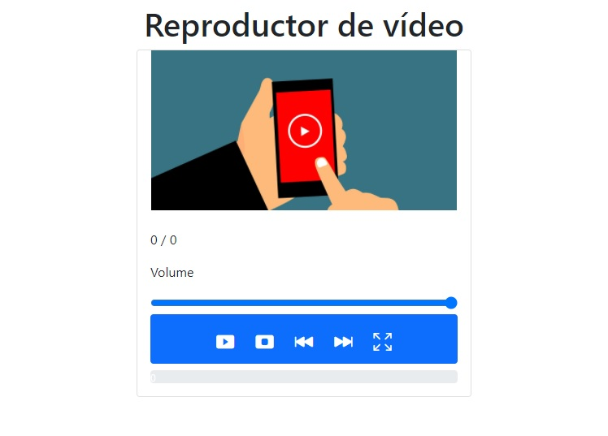

  <h3 align="center">Reproductor de vídeo</h3>

<!-- TABLE OF CONTENTS -->

  
Contenido

  <ol>
    <li>
      <a href="#about-the-project">Sobre el proyecto</a>
      <ul>
        <li><a href="#built-with">Desarrollado en</a></li>
      </ul>
    </li>
    <li>
      <a href="#getting-started">Para comenzar</a>
      <ul>
      </ul>
    </li>
    <li><a href="#usage">Uso</a></li>
    <li><a href="#contact">Contact</a></li>
  </ol>

<!-- ABOUT THE PROJECT -->
## Sobre el proyecto

Este proyecto trata del diseño y desarrollo de las funcionalidades de un reproductor de vídeo personalizado.

### Desarrollado en

* Javascript

<!-- GETTING STARTED -->
## Para comenzar

Hacer git clone del proyecto y ejecutar el archivo index

<!-- USAGE EXAMPLES -->
## Uso

Esta aplicación cuenta con unos controles funcionales que permiten reproducir el vídeo, pausarlo, pararlo, aumentar o disminuir el volumen, adelantar o atrasar el vídeo, y modo pantalla completa.

<!-- CONTACT -->
## Contacto

Francisco Javier Bueno - email@example.com

